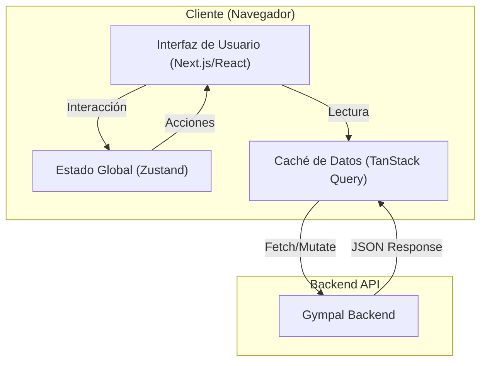

# Gympal - Frontend

Bienvenido al repositorio del frontend de **Gympal**, una aplicación diseñada para revolucionar la gestión de tu vida fitness y social en el gimnasio. Este proyecto proporciona una interfaz moderna, intuitiva y robusta construida con las últimas tecnologías web.

## 🚀 Descripción General

El frontend de Gympal ofrece a los usuarios una plataforma para:
*   Gestionar y visualizar sus rutinas de entrenamiento.
*   Interactuar con otros usuarios (aspecto social).
*   Monitorizar su progreso.
*   Acceder a funcionalidades impulsadas por IA.

La aplicación está diseñada siguiendo una arquitectura basada en componentes, asegurando escalabilidad y facilidad de mantenimiento.

## 🛠️ Stack Tecnológico

Este proyecto utiliza un conjunto de herramientas modernas para garantizar rendimiento y experiencia de desarrollador:

*   **Framework**: [Next.js 14](https://nextjs.org/) (App Router)
*   **Lenguaje**: [TypeScript](https://www.typescriptlang.org/)
*   **Estilos**: [Tailwind CSS](https://tailwindcss.com/)
*   **Componentes UI**: [Radix UI](https://www.radix-ui.com/) (primitivas accesibles) & [Shadcn UI](https://ui.shadcn.com/)
*   **Gestión de Estado**: [Zustand](https://github.com/pmndrs/zustand)
*   **Fetching de Datos**: [TanStack Query](https://tanstack.com/query/latest)
*   **Gestión de Formularios**: [React Hook Form](https://react-hook-form.com/) + [Zod](https://zod.dev/)
*   **Iconos**: [Lucide React](https://lucide.dev/)

## 📂 Estructura del Proyecto

```bash
Gympalfrontend/
├── src/
│   ├── app/            # Rutas y páginas (Next.js App Router)
│   ├── components/     # Componentes UI reutilizables (Botones, Inputs, etc.)
│   ├── features/       # Módulos funcionales (Auth, Workouts, Social, etc.)
│   ├── lib/            # Utilidades, configuración de API y helpers
│   ├── types/          # Definiciones de tipos TypeScript globales
│   └── ...
├── public/             # Archivos estáticos
└── ...
```

## 📋 Requisitos Previos

Asegúrate de tener instalado lo siguiente antes de comenzar:

*   **Node.js** (Versión LTS recomendada, v18+)
*   **pnpm** (Gestor de paquetes recomendado)

## ⚡ Instalación y Configuración

1.  **Clonar el repositorio:**

    ```bash
    git clone https://github.com/Arnaugg9/Gympalfrontend
    cd Gympalfrontend
    ```

2.  **Instalar dependencias:**

    ```bash
    pnpm install
    ```

3.  **Configurar Variables de Entorno:**

    Crea un archivo `.env.local` en la raíz del proyecto y añade la URL de tu backend:

    ```bash
    NEXT_PUBLIC_API_URL=http://localhost:3000
    NEXT_PUBLIC_SUPABASE_URL="https://rkqwxbynswjpwibflfik.supabase.com"
    ```
    *(Ajusta el puerto según la configuración de tu backend)*

## ▶️ Scripts Disponibles

En el directorio del proyecto, puedes ejecutar:

*   **`pnpm dev`**: Inicia el servidor de desarrollo en `http://localhost:3001`.
*   **`pnpm build`**: Compila la aplicación para producción.
*   **`pnpm start`**: Inicia el servidor de producción (requiere `build` previo).
*   **`pnpm lint`**: Ejecuta el linter para asegurar la calidad del código.
*   **`pnpm generate:types`**: Genera los tipos de TypeScript basados en la especificación OpenAPI del backend.

## 🧩 Arquitectura

El siguiente diagrama ilustra la arquitectura de alto nivel del frontend y su interacción con el ecosistema:




